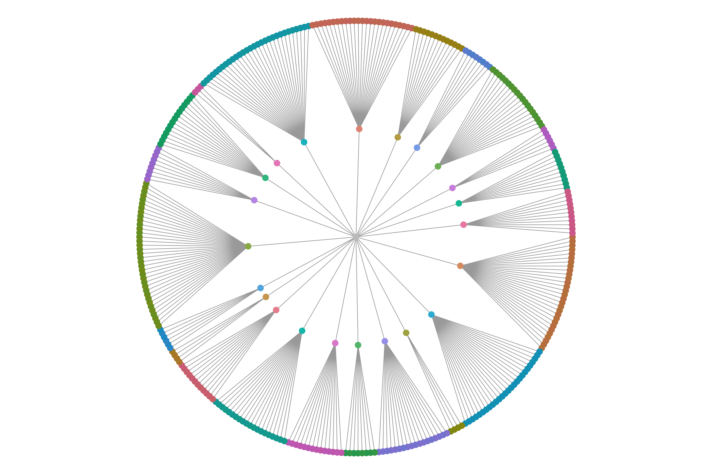
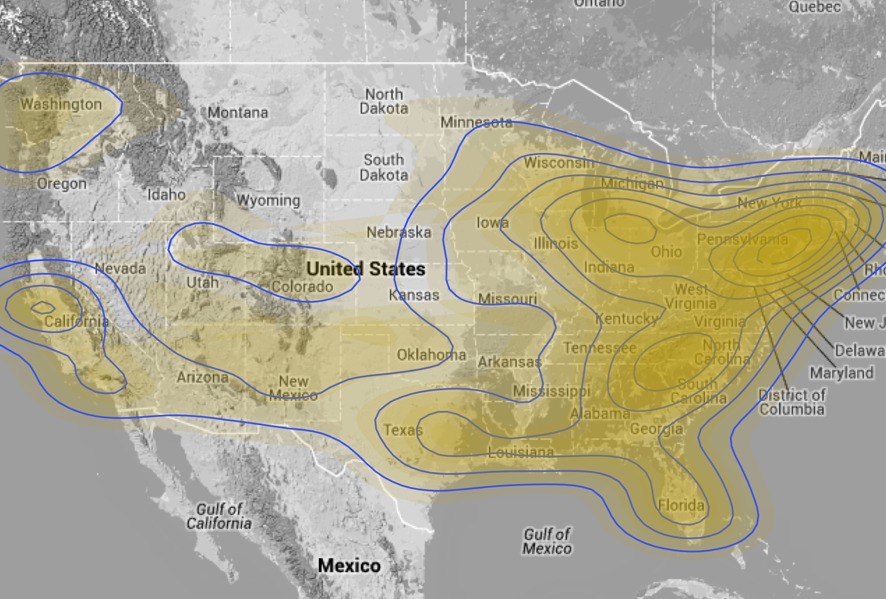
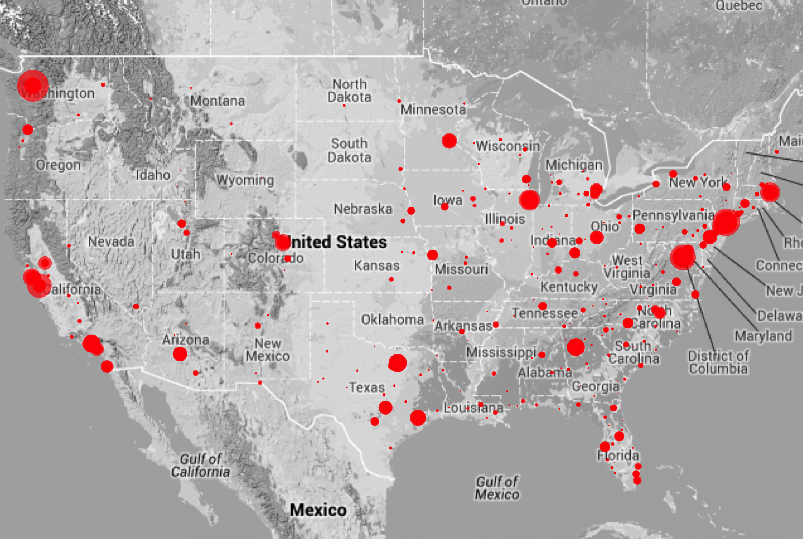
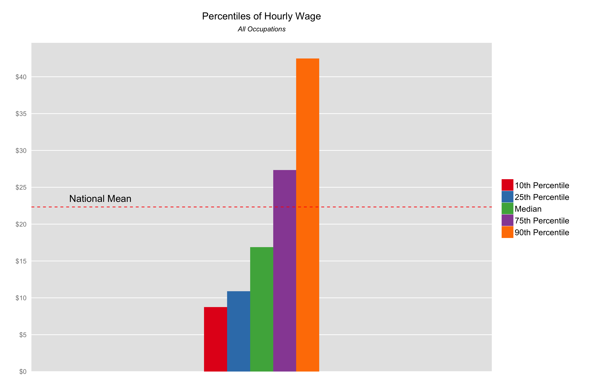
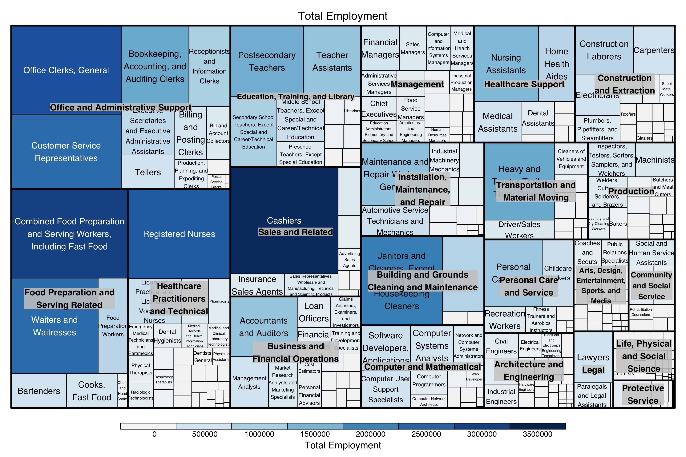
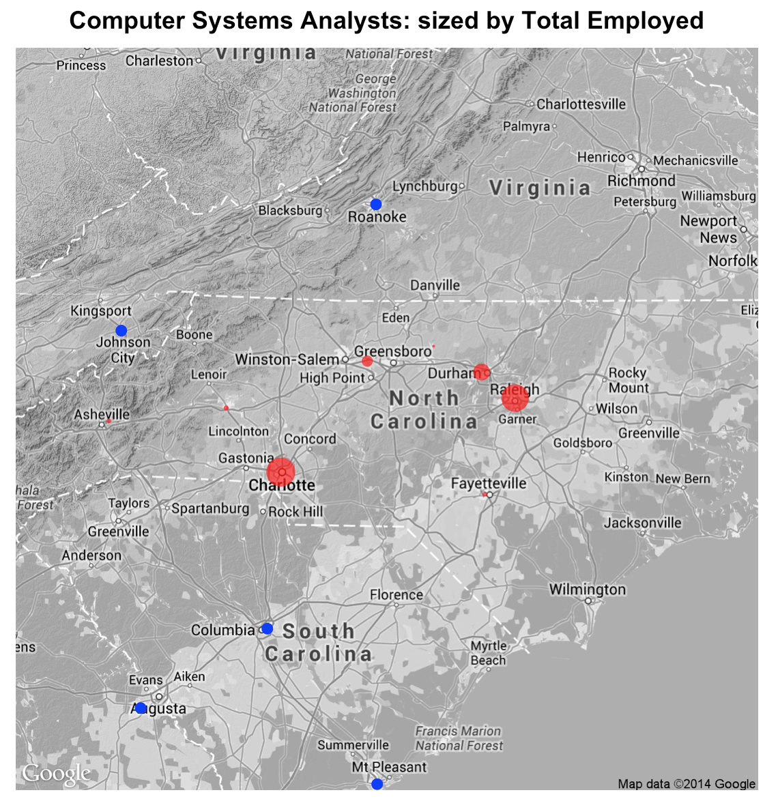
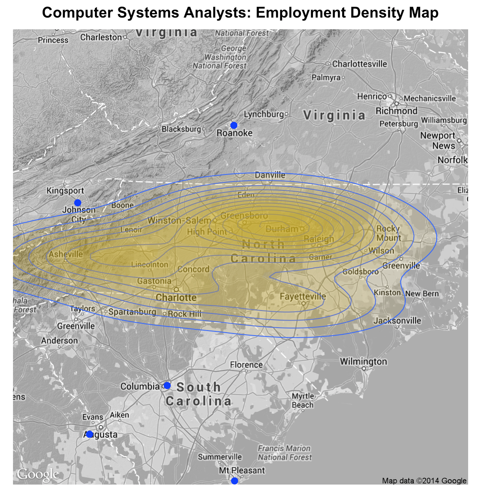

Final Project
==============================

| **Name**  | [Jeremy Gilmore]  |
|----------:|:-------------|
| **Email** | jgilmore@dons.usfca.edu |

## Instructions ##

The following packages must be installed prior to running this code:

- `data.table`
- `ggplot2`
- `ggmap`
- `reshape2`
- `stringr`
- `shiny`
- `treemap`

To run this code, please enter the following commands in R:

```
library(shiny)
shiny::runGitHub('msan622', 'j-gilmore', subdir = 'final-project')
```

This will start the `shiny` app. See below for details on how to interact with the visualization.  If there are any problems with the app, make sure you have installed the proper packages.  If problems still persist, please let me know.  To view images, look at the pdf of the presentation included in the images folder.

BE PATIENT... IF A RED ERROR FADES, R IS WORKING AND YOUR PLOT WILL APPEAR SHORTLY.

## Discussion ##

-**The Data**  This dataset uses data from the Bureau of Labor Statistics' Occupational Employment Statistics (OES) and Occupational Outlook Handbook (OOH).  The data has national, state, and metro area levels for 22 industries and nearly 400 professions.  There are five files from the OES available in .csv format from BLS.  The OOH data has been scraped using a python script.  

To get latitude and longitude data, MAXMIND's Geolite data was used.  To merge, metro areas were truncated to use the largest city listed.  The Geolite data has lat and lon values by zip code, so population statistics were gathered by zip code (from US Census data) and the city zip with the largest population was used as a proxy for city lat and lon coordinates.

Data files were then merged to make a set of master files.  Additional files were created that have lat and lon coordinates for the center of states, and lists of surrounding states.



-**Tree Graph**  The tree graph is a great way to visualize the structure of the data.  This visualization was meant to be more informative than interactive.  With the inner ring of points representing the 22 industries, it is possible to see how many professions originate from the industries.

Due to the structure of the data, some visualizations are limited with respect to how they can be visualized.  Acknowledging that people can generally retain only five to nine colors, because there are 22 industries and within each industry there are multiple professions, color does not contribute other than for general hierarchical structure.  This is seen here with nodes and their parents of the structure selected.  The color in this visualization is not important, but mentioned here as this issue comes up with limitations to how interaction is possible with this dataset.  

The visualization is elegant in its simplicity.  The purpose is served quite well.  The interaction shows added levels, or perhaps the distribution of positions at the state level.  With respect to detail about the data within, this type of visualization is not useful.  But to merely show structure, a tree graph does well to encapsulate hierarchy.



-**National Density Plot**  A great deal of effort went into this plot.  Effort not readily measured because in the end, a choice was made with respect to the underlying base map.  Using get_map from ggmaps, a Google map was selected because of its level of detail.  The left and right margins appear to cut the map short, eclipsing some of the data.  After a numerous attempts were made at extending the margin, a workable solution did not present itself.

The Google base map was scrapped, and a simple base map was selected that had only outlines of the states.  After modifying the plot to make the proportions reasonable, when the plot rendered, the appeal was lacking given the previous detail of the Google map.  Because of the nature of the density plot a certain level of transparency allows context to be given through the plot's image.  The detail of the Google map adds to the understanding and relationship with the data.

The point of using maps in general is to give context to the data presented.  At then end of the exercise, the Google map was selected, given the sacrifice of the data at the margins.  There is also a consolation of congruency and consistency described in other plots below.  Perhaps this was the wrong decision, but if more time available, additional work would be devoted to finding the workable solution that extends the margins of the Google map.

With respect to the density plot itself, the number of bins and polygon outlines make the plot.  The goal is to show density, but not to overshadow the context below.  We are used to this type of visualization with weather and storms.  In this visualization the base map is just as important as the density represented above.  For this reason, a light color was used, with the only darker hues of yellow but not differing colors of increased density.  This is intentional, hence the qualitative color difference of the polygons surrounding the layers.

Zooming is made possible, not geographically (in this visualization), but with the data itself as each industry is able to be viewed on a national level.



-**National Bubble Plot**  While the data subsetting methods are the same, and the underlying base map is the same, a bubble plot shows the data points with the highest number of total employed in larger bubbles using the latitude and longitude points for metro areas.

The point of showing these two plots together is to visualize how the same data can be viewed using differing techniques and how the possible interpretation of the data may change.  Geographically speaking, we know that there are many areas desolate, even within eastern states.  With the density map, it may appear that the entire eastern seaboard is heavily populated with employed citizens.  However, when visualizing using bubble points, it is readily apparent that only the cities are populated with employed citizens.

The contrast of red bubbles on the gray map is intentional and really makes the data points pop.  A certain level of alpha was used, but sparingly as the intention is to only show an overview, and the goal was not to reduce the quality of the image.

This is a useful exercise to see how the binning process changes the interpretation of data.



-**Grouped Bar Plot**  The design and intent of this section of the app was to have an industry health overview that provided a snapshot of each industry.  While this idea could have been implemented, it would have been better designed to evaluate each profession with an industry.  The number of industries, and even the number of professions within each profession make this difficult to do visually.  The differences can be readily made available in a table numerically, but how to implement a brushing technique that makes sense with an easy interface proved a difficult task for the scope of this assignment given the other goals of the app.

An attempt to make some of the data available tables were included in the visualization to support the grouped bar plot of the selected industry.

With respect to the plot itself, percentile wages were melted and subsetable by industry classification.  Similar subsets are created for the table that are mean values of professions for the selected industry.  So while brushing doesn't take place visually, it is reflected in the sidebar table.

Ideally, given more time to troubleshoot, a feature that would have allowed for the selected industry to be highlighted in the table below the plot.  Instead of only showing the data for the selected, the intent of this app is to show context.  In this sense, context with relation to other industries.



-**Tree Map**  Not realizing it, this plot became the most fun interactive created for the app.  Again, context is the goal of understanding the data for this application.  Using only a couple metrics for this visualization, the user can dive deep into the data and really gain an understanding of the scope of the data.

A tree map works well as this data can be thought of as the many parts that make up the whole.  On a national level, it is possible to visualize the all industries and the respective size of the industry in numbers employed, or if desired, by wage.

Within each industry, the professions can be visualized in the same way.  This is a great way to see the concentration of positions and wealth earning potential.  Brushing even further, each state can be isolated to see the composition of the states' economy and the wealth within.  All or individual industries can be selected.

At the Industry level, the relative size of each states' role in the market size or concentration of wealth can be visualized.  Even more brushing is possible as individual professions can be visualized in the same way.  This is a very deep and complex analysis of the data.  If All Professions of All Industries is selected, please be patient as the plot takes a while to render.  This does however show the relative size of each profession in relation to others for each state.  A great level of detail is able to be visualized.  Quite elegant, the level of data represented in the image.  All plots highly customizable depending on how the user wants to interact with the data.

These are probably the best plots of the app.




-**Density/Bubble**  Previously in the national overview it was alluded to that additional detail would be made available for the user to get more intimate with details of the data at an industry or professional level.  While the same techniques are used in the previous plots, but this time the additional state latitude and longitude files are used in conjunction with the neighboring states file.

Alpha is more evident in the bubble plots, with the size of the bubble representing the total number of employed for that particular metro area.  This is only the case for the selected state.  Effort was made not to overshadow the key information in neighboring states, therefore data represented in those states is represented by constant size and whole alpha.  This is deliberate.

A simple implementation was to add the choice to visualize by employment density.  A different number of bins was selected, hopefully to optimize the visual nature of the represented data.

Also additional features were represented with detailed profession descriptions available in the sidebar panel and customizable table ordering depending on the selected metric.  What is great about the table is that only the top ten rows are visualized.  The content is dynamic, so as different metrics are selected, new locations may appear accordingly.

-**Interactivity**  One of the main goals of the app design was to allow the user to interact with the data.  Using basic techniques, mainly simplicity, relevant features were highlighted but consistently applied to allow the user to gain a decent amount of information from the app without having to interact too much with techniques applied.  Basically, make most of the decisions for the user, and provide an interface that enabled a relatively clear interactive experience; make the user interactive with the data, not the app or its design features.  The same techniques were used throughout the app for consistency.

A simple navbar was used that had a hierarchy built in to show the data as a whole, national level overview, industry level overview, distribution details of industry and profession, finally local level details.  Levels are reinforced by design in the arrangement of the selections available.

On each page, effort was made to be descriptive in the titles for the functions and applied filters.  When appropriate, supplemental information provided in terms of a static description (The Data) or dynamic descriptions (Local Stats).

The titles of most plots are also dynamic to further indicate the selections made by the user.  In this way, the ability to get lost within the data is mitigated.

-**Prototype Feedback**  The prototype demonstrated had limited functionality of the project.  The app had an interface similar to the final project, but only the local stats section was enabled.  The user could access any of the professions within the Management industry along with any state.  The resulting output would show a description of the profession from the Occupational Outlook Handbook, a table with relevant stats of the profession including total employed, employed per 1000, and wage data specific to cities within the state selected.  

Also a plot is shown that renders a map called from google maps in real time.  Using ggmaps, the render uses latitude and longitude values to plot cities that have data associated with the selected profession.  The points are sized by total employed.  A subset is created also showing cities of surrounding states who fit the criteria.

Some questions were raised about the choice of map by google.  It was recommended to confirm the map choice was the best so as to highlight the relevant information.  Instead of calling the maps in real time, use `dput` to save the map images to mitigate processing time.  Also there was an issue with the subset of surrounding states' city data.  All of the recommendations were valuable, and I appreciated the insight and programming knowledge.  Not a native programmer, a lot of the implementation is a result of piecing together code snippets from stack overflow and other similar sites.

-**Challenges**  The most difficult aspect of this project was the data itself.  There was a lot of effort put into organizing the data that when even from the same source had differences which had to be standardized and controlled for.  The organizational structure of the data presented some limitations that were mentioned above, but at the same time made the visualizations elegant when able to view from a far.

All of the subsequent decisions related to the maps selected was made after the prototype exercise.  The input was valuable, but had to consider what was available at the time, given the deadline at hand. 

Time is always a challenge.  To create a plot well can result in a great deal of time spent making modifications, then more modifications.  There are so many additional features and additional plots that could be created given the size and complexity of the dataset.  Industry level, even professional level analysis could be done by state, or even metro area.  It would be fun to provide even more analysis.  For this app however, the plots provided were appropriate given the over-arching goals to provide context of industries and professions both geographically and in terms of wages earned.  Given alternate goals, a whole slew of new plots could be designed.

