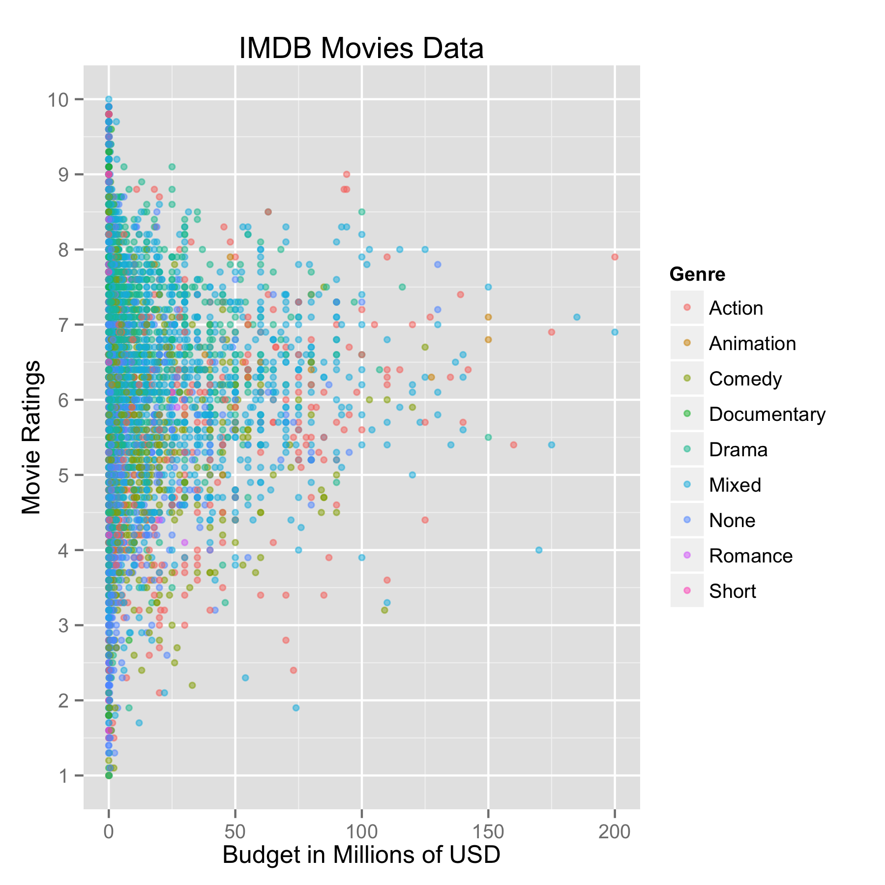
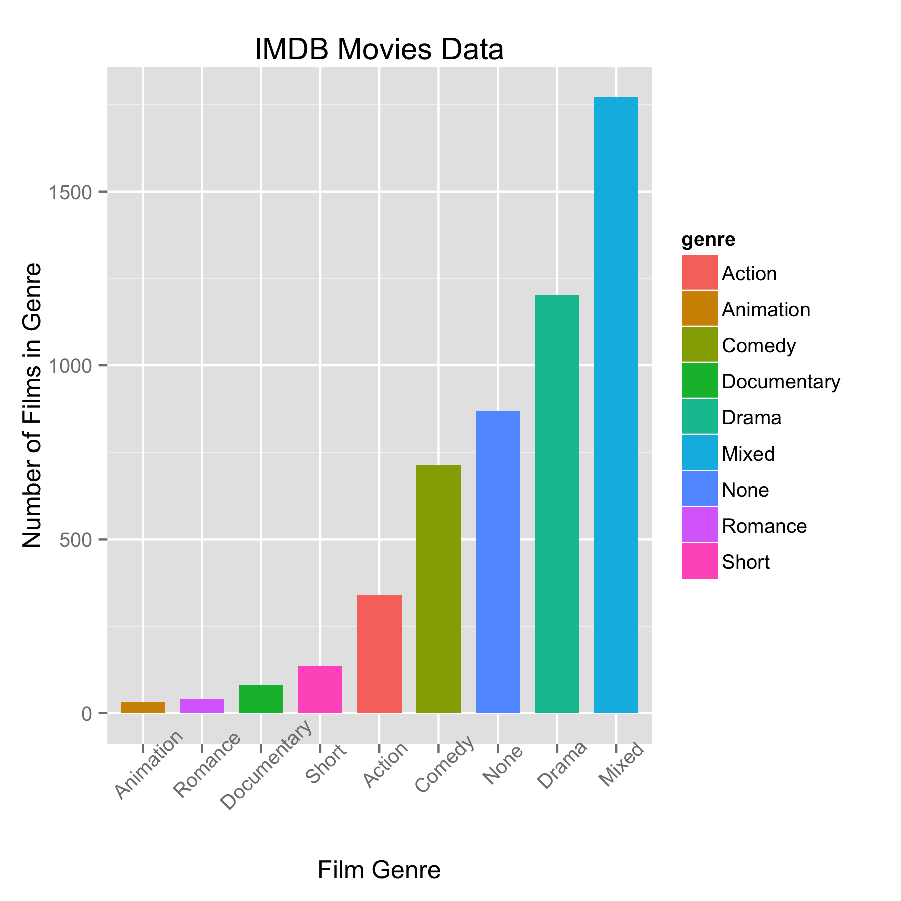
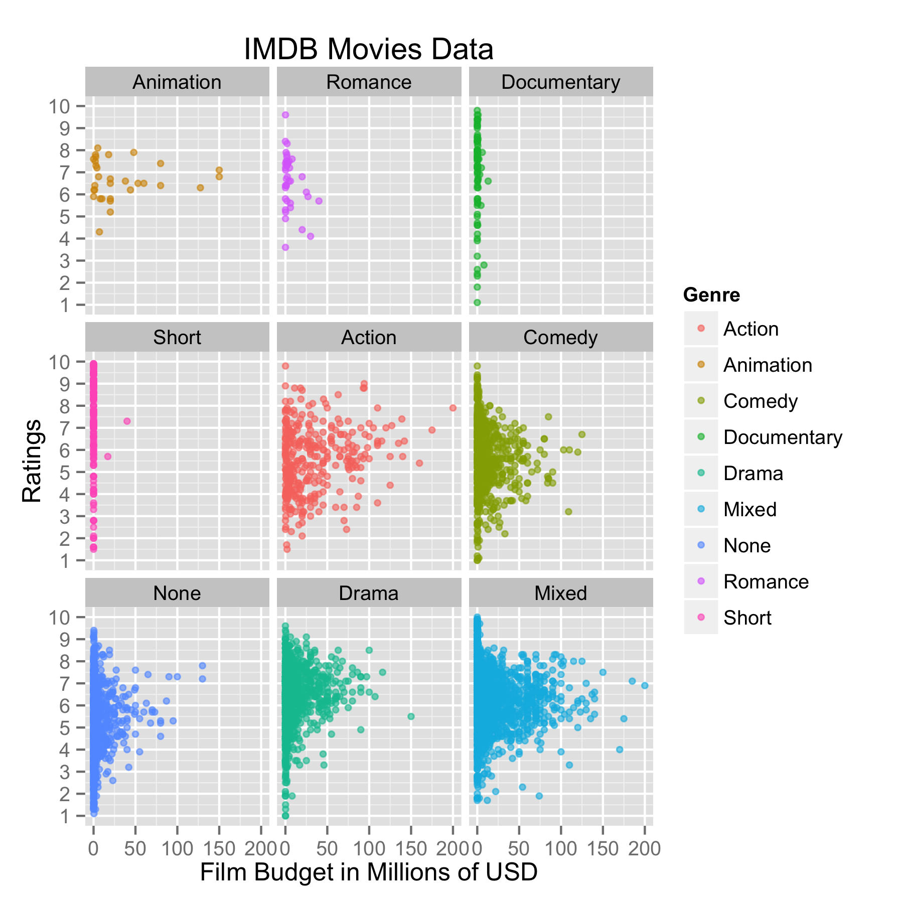

Homework 1: Basic Charts
==============================

| **Name**  | Jeremy Gilmore  |
|----------:|:-------------|
| **Email** | jgilmore@dons.usfca.edu |

## Instructions ##

The following packages must be installed prior to running this code:

-'ggplot2'

To run this code, please enter the following code into R:

source_url("https://github.com/j-gilmore/msan622/tree/master/homework1/homework 1.r")

The code should run with a single execution.  Before you execute, consider the following: 
-Change or set the working directory to save output.  
-Each image is printed to the screen, so comment out the print statements if you do not want images printed to screen.

## Discussion ##

- **Plot 1: Scatterplot.** Due to the density of the of the plot, I opted for a small point shape and altered the transparency so that as density increased so does the darkness of the points.  Also because of the values of budgets, I altered the variable to reflect millions of dollars so the x-axis labels are more easily readable.  The y-axis scale was changed to reflect a reasonable scale for viewers to understand ratings.

- **Plot 2: Bar Chart.** Thinking of congruity of the graph series, you will notice the legend remains in the same place and the colors are the same.  In this graph, the order of bars was important not by alphabetical order, but instead value of the bar so that relative values could be more easily interpreted.  X-axis labels were also displayed at a 45 degree angle so they could be read.

- **Plot 3: Small Multiples.** Again for consistency, the same colors and ordering is used to show frequency and density.  The same units are used for budget (in millions of dollars), and a slightly less transparent point is used for there are fewer points per graph.

- **Plot 4: Multi-Line Chart.** A challenging aspect of this graph is to keep the scale in proportion for each axis so that the data represented was not distorted.  For that reason, the legend was moved.  Also this helped to alleviate the blank area in the upper left quadrant of the visualization.  Also in the legend, more information was conveyed by also including the country of origin for each index.  Additional y-axis ticks were added so viewers could see major performance values and x-axis label removed because "time" is redundant.