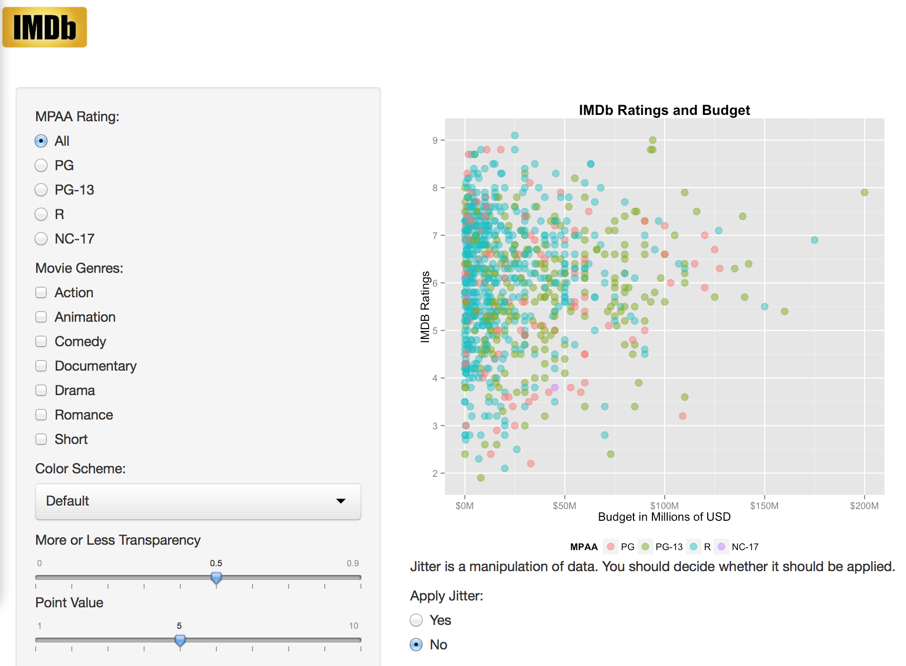

Homework 2: Interactivity
==============================

| **Name**  | Jeremy Gilmore  |
|----------:|:-------------|
| **Email** | jgilmore@dons.usfca.edu |

## Instructions ##

The following packages must be installed prior to running this code:

- `ggplot2`
- `shiny`
- `scales`

To run this code, please enter the following commands in R:

```
library(shiny)
shiny::runGitHub('msan622', 'j-gilmore', 'homework2')
```

This will start the `shiny` app. See below for details on how to interact with the visualization.

## Discussion ##



This visualization is meant to be interactive.  Please adjust the settings to see how the information presented can be manipulated and personalized.  

-**MPAA Rating**  This section allows the user to toggle between the various ratings offered by the Motion Picture Association of America (R).  The default setting is to view the results of all ratings in the dataset.

-**Movie Genres**  This section allows the user to view all movie genres, or selected subsets of genres.  Each time a combination of `MPAA Rating` and `Movie Genres` is selected, a subset of the dataset is created for the visualization.

-**Color Scheme**  Selecting among various color schemes within the `ggplot2` library is possible from the drop down menu.

-**More or Less Transparency**  By increasing transparency, the user is able to alleviate some of the concerns related to over-plotting when points lie on top of each other.  If more transparency is used (lower `alpha`), the darker areas will represent the overlap and multiple data points.  This inverse scale was used rather than assuming the user understands the term `alpha`.

-**Point Value**  This scale allows the user to create larger or smaller dots depending on their needs.  It may be advantageous to use smaller points when viewing more films represented by the data points, or larger points when viewing fewer data points.

-**Additional Features**  In addition to the standard requisites for this project:

-  Notice the use of the IMDb logo in place of the header line.  Adding an iconic logo can help the user quickly identify with what is being presented.  The user will be able to identify the data more easily.  The title of the page still is visible in the browser window.  Admittedly, the padding should be modified to eliminate the gap between the logo and the sidebar panel, but the css couldn't be isolated.  The benefits of using the logo perhaps outweighs the gap.

-  The added option for the user to `jitter` the data points, and a word of caution about altering the data taken from an external HTML file, are presented in the main frame of the page rather than the sidebar.  The decision of whether or not jitter is applicable should not necessarily be that of the creator of the visualization, but instead by the user.  If jitter is applied, maybe it is best that the user know the data represented is not entirely accurate.  Such a thorough description of jitter isn't relevant, only that it exists.
