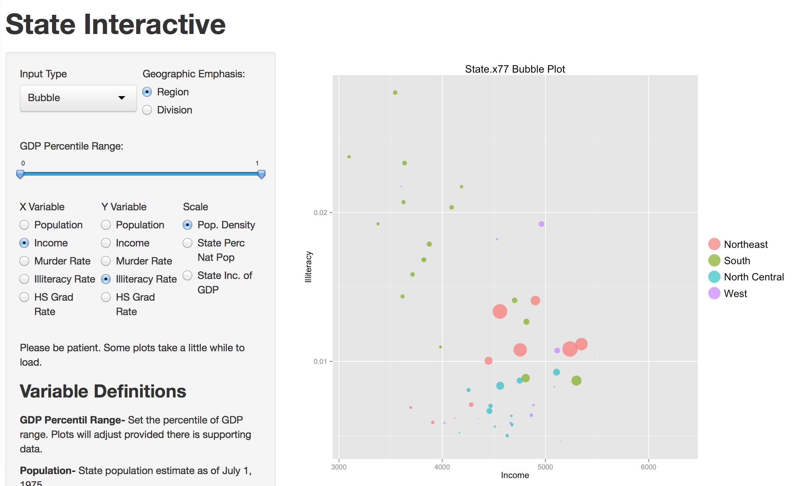
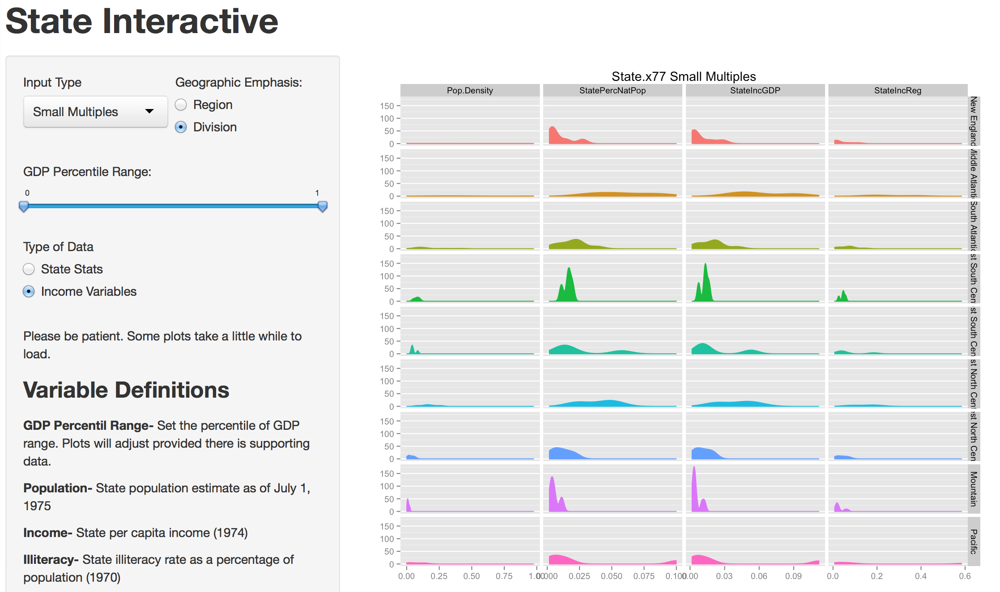
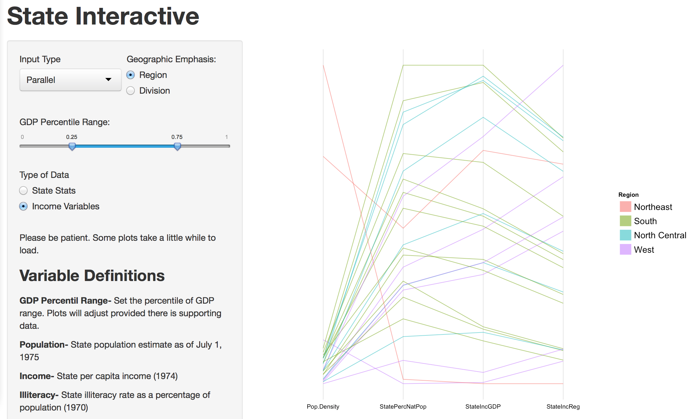

Homework 3: Multivariate
==============================

| **Name**  | [Jeremy Gilmore]  |
|----------:|:-------------|
| **Email** | jgilmore@dons.usfca.edu |

## Instructions ##

The following packages must be installed prior to running this code:

- `ggplot2`
- `grid`
- `shiny`
- `lattice`
- `GGally`
- `reshape2`

To run this code, please enter the following commands in R:

```
library(shiny)
shiny::runGitHub('msan622', 'j-gilmore', 'homework3')
```

This will start the `shiny` app. See below for details on how to interact with the visualization.

## Discussion ##



This visualization is meant to be interactive.  Please adjust the settings to see how the information presented can be manipulated and personalized.  Due to the amount of data being rendered, some of the plots take a moment to load.

The menu is dynamic and some variable choices are only available during certain plots.

-**Bubble Plot**  This section has a customized menu that only appears when Bubble is selected from the drop down menu.  The user can select which variable should be associated for both the x and y axis.  By allowing the user to select the same variable for both axes, the user can visualize the distribution of the variable in question.  The user also has the ability to select which scalar to use for the size of the bubbles from new variables created by aggregating national figures from the original dataset.



-**Small Multiples**  This plot uses a few less variables than the bubble plot requires, therefore a different sub-menu is used.  The user can select from two variable choice combinations and compare Divisional or Regional data.  The small multiples allows the user to see similarities as well as differences among various subgroups.  Due to the quantity of data, this plot may take a little while to load.




-**Parallel Coordinates Plot**  For consistency with the small multiples plot, the same sub-menu and variables were used.  This allows the user to quickly understand the variables shown.  In this graph, the GDP Percentile Range slider (filter) is useful.  A narrow range can be selected that will eliminate some of the observations to see which regions or divisions are significant.  However, if the range slider is too narrow no observations will be visible.


-**Additional Features**  In addition to the standard requisites for this project:

- New variables were created to get an understanding of not only state-level data, but how the states relate to the nation as a whole.  Some of the customization was not in the plots themselves, but instead by implementing new features in the `shiny` app.  Use of a dynamic menu, and external text file so that users can see the variable definitions.  The menu was also modified to use fluid rows that is a more effective use of space.

Also, it might not be immediately obvious which states fall into which region or division.  Effort was taken to make the experience somewhat intuitive.  Hopefully by including the definitions there wouldn't be any confusion about how to interpret.

- For each plot the user has the option to select region or division, as well as state statistic variables or national economic data.  The thought process is that it might be relevant to determine how the states stack up as their contribution to national statistics.  The use of the GDP percentile slider was meant to give the ability to filter various quantiles of data to see how states at low, mid, or high percentiles contribute to national statistics.  The slider does work to filter for each of the plots.

-  Combining the plots into a single function proved difficult as it was tough to pass certain inputs.  For that reason, some of the code is quite ugly.  But it works other than the error messages as plots are loading or there is no data to support the user request.