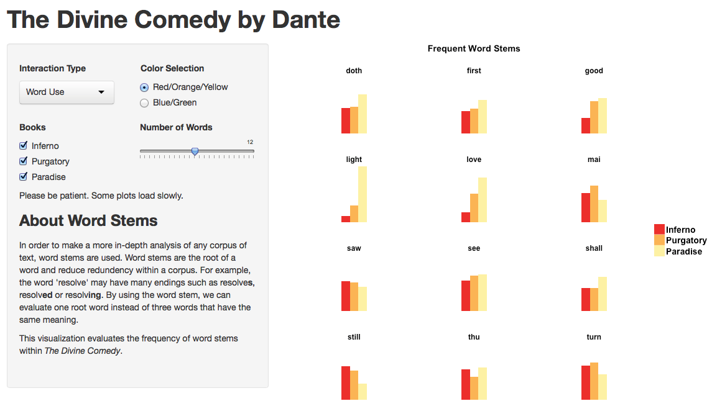
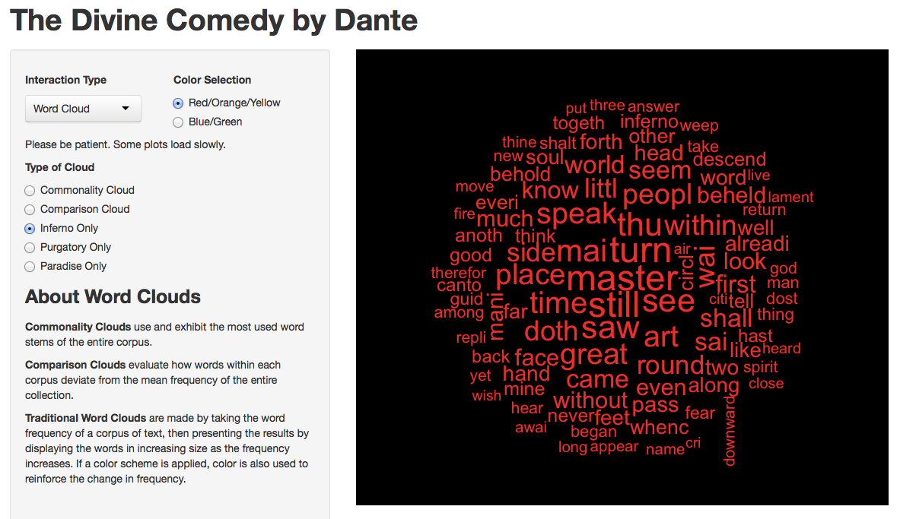
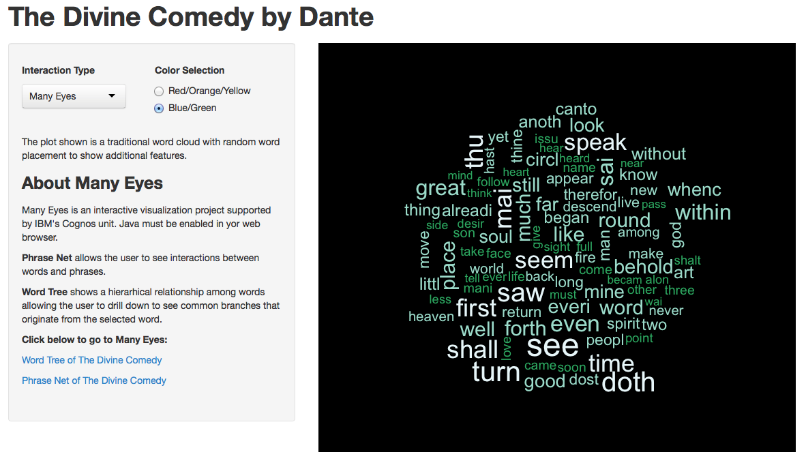
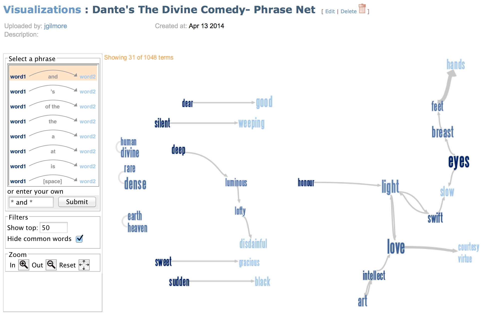
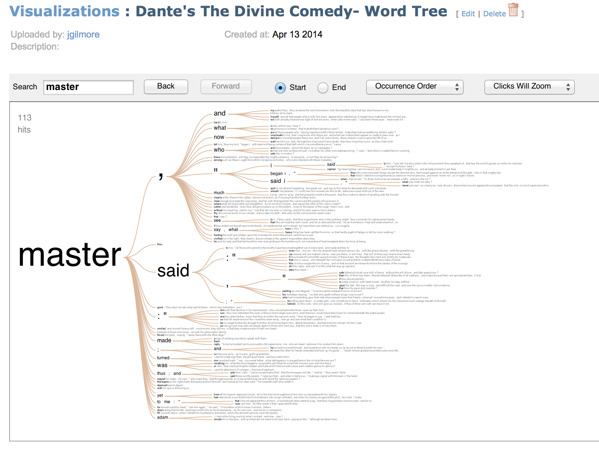

Homework 4: Text Data
==============================

| **Name**  | [Jeremy Gilmore]  |
|----------:|:-------------|
| **Email** | jgilmore@dons.usfca.edu |

## Instructions ##

The following packages must be installed prior to running this code:

- `ggplot2`
- `grid`
- `reshape2`
- `shiny`
- `SnowballC`
- `tm`
- `wordcloud`

To run this code, please enter the following commands in R:

```
library(shiny)
shiny::runGitHub('msan622', 'j-gilmore', subdir = 'homework4')
```

This will start the `shiny` app. See below for details on how to interact with the visualization.  To visualize the applications on the Many Eyes(tm) website you need to have Java enabled in your browser.

## Discussion ##

This visualization is meant to be interactive.  Please adjust the settings to see how the information presented can be manipulated and personalized.  Due to the amount of data being rendered, some of the plots take a moment to load.

-**The Divine Comedy by Dante Alighieri** This work was chosen to show how a single author can vary their mood and theme.  Further, this has been emphasized within a single masterpiece of classic literature.  The corpus is from a single translation provided by the Gutenberg Project.  Each book was then extracted as a subset.  The goal was the ability to compare and contrast within a single context.




-**Small Multiples**  This plot uses a few some very simple techniques to exhibit frequent word stems common to all three books.  The color scheme was selected to further the concept of hell, purgatory, and the afterlife.  The plot may appear simple, however it is very complex and was somewhat difficult to implement as envisioned.  

The grouped bar chart is faceted, but centered instead of in its natural position of the facet.  The user can select individual books or pairs and the colors represented by the color scheme remain constant.  Also present is the ability to show how many words are represented.  Theoretically all could be shown, but the visual appeal decreases as more word stems are added.  The small multiples allows the user to see similarities as well as differences among various subgroups.  Due to the quantity of data, this plot may take a little while to load.




-**Word Clouds**  Because of the corpus selected, additional word clouds are able to be rendered.  A black background was chosen because the contrast has visual appeal and the user does not have to read the text, but visualize it.  The dynamic menu allows the color choice to remain constant throughout the user experience.

- Commonality Cloud is a word cloud that shows common words throughout the entire work.  The color scheme is then hierarchical with the more frequent words shown with lighter colors.

- Comparison Cloud shows how words within each work deviate from mean frequency of the overall corpus.

- Individual Couds are then available to which are unique to the book selected.  Note how the colors stay the same as the user has gotten used to the colors associated with the respective books.





-**Many Eyes**  External links are provided for two visual interactions available through IBM's Many Eyes website.  Java must be enabled for the visualizations to be interactive.

- Phrase Net of the Divine Comedy allows the user to show how common words interact with each other throughout the work.

- Word Tree allows the user to type a word and then can drill down to see common use and branches that originate from selected word.

Previews of the Many Eyes visualizations are shown below.

-**Comments** The goal was simply present the information from the corpus.  While perhaps a lot more could have been done to allow for interaction with the wordclouds, it may have detracted from the elegance of the visualization.  Wordclouds are not very useful beyond the image they present, so why deviate?  The small multiples plot however, is a very technical and purposefully designed plot.  Hopefully you enjoy it.




