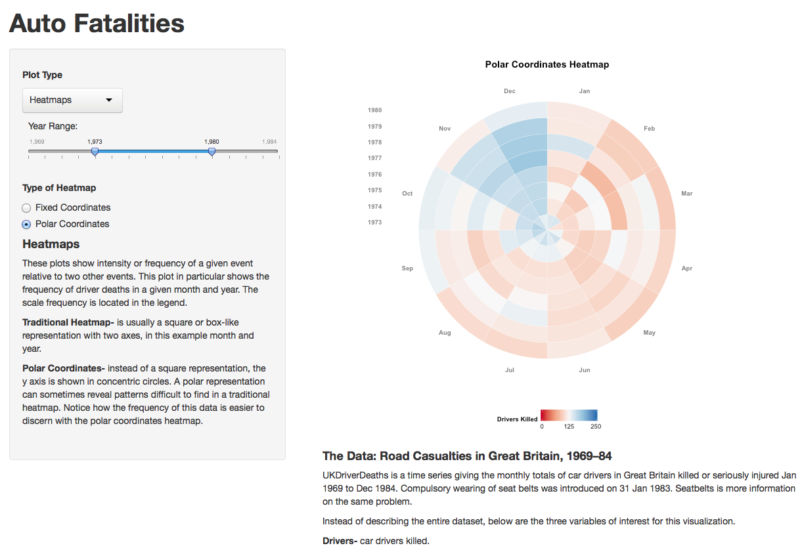

Homework 5: Time Series
==============================

| **Name**  | [Jeremy Gilmore]  |
|----------:|:-------------|
| **Email** | jgilmore@dons.usfca.edu |

## Instructions ##

The following packages must be installed prior to running this code:

- `ggplot2`
- `grid`
- `RColorBrewer`
- `reshape2`
- `shiny`
- `scales`

To run this code, please enter the following commands in R:

```
library(shiny)
shiny::runGitHub('msan622', 'j-gilmore', subdir = 'homework5')
```

This will start the `shiny` app. See below for details on how to interact with the visualization.  If there are any problems with the app, make sure you have installed the proper packages.  If problems still persist, please let me know.

## Discussion ##

Some of the plots take a moment to load, so please be patient.  The ability to select years using a slider scale can be used throughout the application.

-**Heatmaps** The goal for this presentation is to show the functionality of traditional, fixed coordinates heatmaps and polar heat maps.  In these plots, the frequency of the choice variable is shown with the diverging color scale.  An on-screen explanation is offered about heatmaps and how to interpret a polar coordinates heatmap.  

These plots are very efficient with a high data-ink ratio.  Every cell represents relevant data and easily conveys a message.  A word of caution however, polar coordinates heatmaps do add to lie factor.  The lie factor can though be worth it if the data is shown in a more concise way.  This polar plot reveals a pattern not easily visible in the traditional heatmap.




-**Area Charts**  These plots are often misinterpreted because users do not know whether or not the area represents separate values or shares of the whole.  Only use this type of representation if the message can be clear as to how the user is to interpret the data.  Instead of a diverging color scheme, a qualitative scheme is used as each variable needs to be clearly identified without any additional hierarchy inferred.

Data-ink ratio is fair among these plots, but in general there are usually more effective ways to visualize the data.  Lie factor is subject to the scale of the representation.  The skew of either the x or y axis can severely alter the interpretation of the plot.  This is also true with the polar coordinates plot.


-**Multi-Line**  Perhaps these are the most easily interpreted, but possibly due to rote conditioning of the general population.  We have been inundated with 2D line plots, therefore we know what to expect.  Here, a qualitative color scale is used to clearly show the variables in question.  Two plots are offered: Small Multiples and Polar Coordinates Star Plot.  Small multiples are a way of getting more information from smaller increments of time periods.  The polar coordinates star plot is useful for only a single year (cycle) to show how the variable is affected throughout the period.

The data-ink ratio is very low compared to all size of the plot.  Simplicity, however is hard to trump.  Lie factor is always a concern depending on the scale of the axes.


