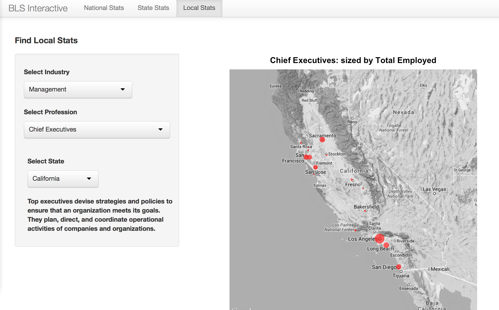
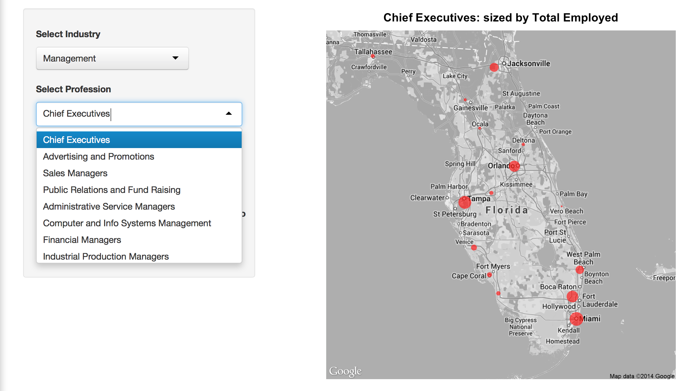
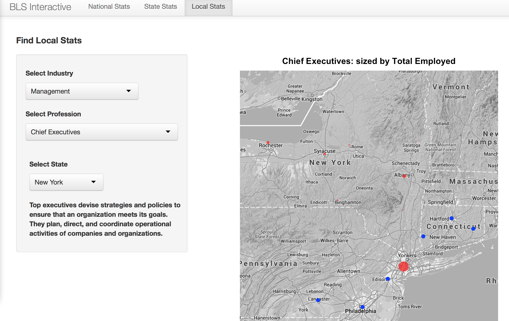
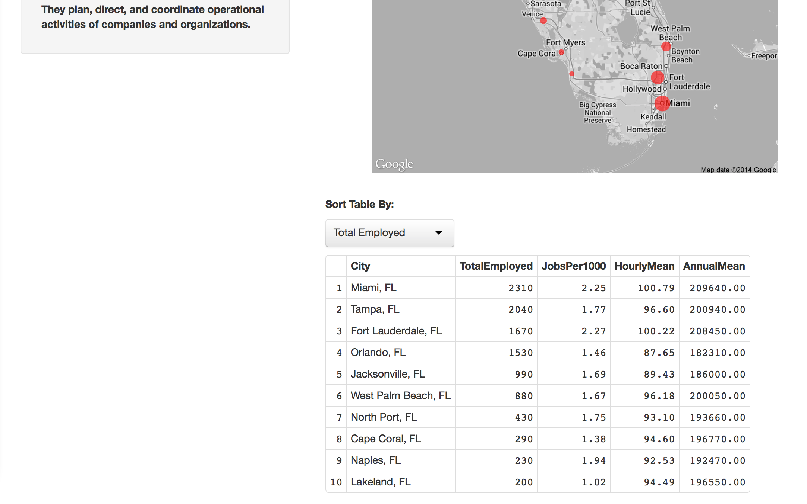

Project Prototype
==============================

| **Name**  | [Jeremy Gilmore]  |
|----------:|:-------------|
| **Email** | jgilmore@dons.usfca.edu |

## Instructions ##

The following packages must be installed prior to running this code:

- `data.table`
- `ggplot2`
- `ggmap`
- `shiny`

To run this code, please enter the following commands in R:

```
library(shiny)
shiny::runGitHub('msan622', 'j-gilmore', subdir = 'project-prototype')
```

This will start the `shiny` app. See below for details on how to interact with the visualization.  If there are any problems with the app, make sure you have installed the proper packages.  If problems still persist, please let me know.

## Discussion ##

Please keep in mind, this is only a prototype.  Not all functionality is present.  The goal was to implement one of the more difficult visualizations.  Additional features will be implemented.



-**Bureau of Labor Statistics**  Only local data currently has interactivity.  The visualization shows professions within industry categories by state.  A Google map is rendered depending on user input.  Points are sized using lat and long values corresponding with total number of individuals employed in selected professions.  Customized descriptions are shown for each profession upon selection in the side panel.



Because proximity is always relevant to users, data points are shown in neighboring states with the same profession.  Only the primary state is shown with employment figures.



A table is shown below each plot that allows the user to sort details relevant to the state and profession selected.  Top-ten values are available for Total Employed, Number of Employed per 1000 citizens, and Wage.



Additional implementation will include national and state-level data.  The interface will be similar for consistency, but different graphical representations of the data will be made available.